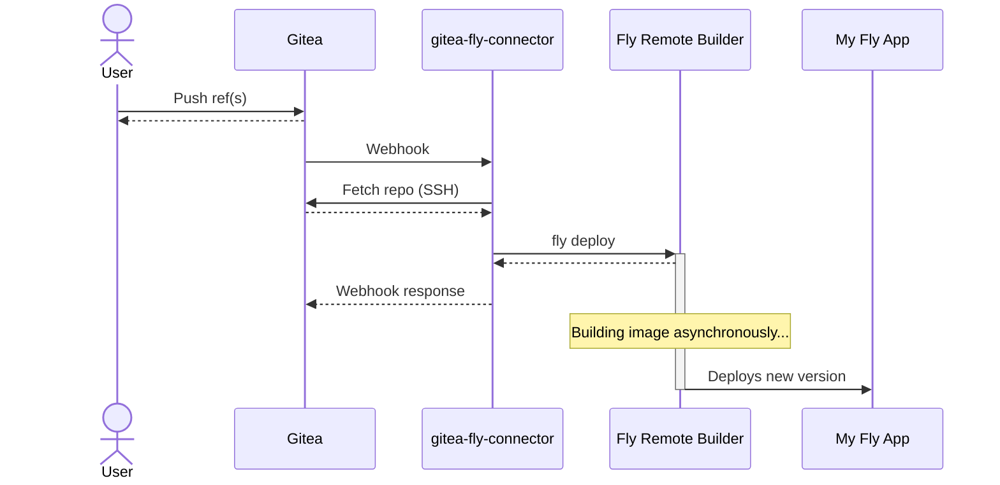

# gitea-fly-connector

Gitea Fly Connector (GFC) is a shim between [Gitea](https://gitea.io/en-us/) and [Fly.io](https://fly.io/) to enable low-overhead deployments of apps hosted in your private Gitea instance.

Have you ever thought, "Man, I wish I could easily trigger Fly deployments when I push commits to my self-hosted Gitea instance, but I don't want to pull in a full CI/CD solution!" If so, you've totally found exactly the right tool.

> If you thought, "Hey that sounds cool, but I don't have a self-hosted Gitea instance running in Fly," I have a blog post that might help: https://blog.luketurner.org/posts/gitea-on-fly/

How it works:

1. You run an instance of GFC in your Fly organization. Suppose your GFC app is called `my-app`. 
2. You configure your Gitea repositories to send webhooks to `http://my-app.internal:8080`
3. When GFC receives a notification of a push to the main branch, it will:
   1. Create a temporary directory in the GFC container.
   2. Clone the repository and checkout the pushed commit.
   3. Run `fly deploy --remote-only` in the repository root directory.

For a more detailed explanation, see [Usage](#usage).

GFC is designed specifically to work with Fly.io's remote builder feature. No actual image building happens in the GFC container itself.

GFC is MIT Licensed and is built as a "for-fun" project. GFC is written in [Clojure](https://clojure.org/) and run with [babashka](https://github.com/babashka/babashka).

## Usage

GFC is intended for running in the Fly.io cloud, but it can also be run in Docker, or locally (i.e. without containers). All three usages are outlined below:

### Fly.io Setup

```bash
cd gitea-fly-connector

# create the app, don't deploy yet. We want to add our secrets first.
fly launch --no-deploy

# generates secrets and adds them to Fly -- take note of token to put into Gitea
bash generate_webhook_secret.sh

# Generats SSH keypair and adds it to Fly -- take note of SSH public key to put into Gitea
bash generate_deploy_keys.sh

# The update_host_keys.sh script will use ssh-keyscan to read the server's current host keys
# and configure GFC to use them. Pass your Gitea server's hostname as the first argument:
bash update_host_keys.sh mygiteainstance.example.com

# This secret has to be generated in Fly dashboard -- will be used to deploy your apps
fly secrets set "GFC_FLY_TOKEN=MYTOKENHERE"

# deploy the app
fly deploy --remote-only
```

Any additional environment variables can be either added using `fly secrets set` (for secret values) or put in your `fly.toml` (for non-secret values). See [Environment variables](#environment-variables) for a list of all the available variables.

Then, in Gitea dashboard:

1. Open Repo Settings
2. Open Deploy Keys and add the SSH public key from `generate_deploy_keys.sh`
3. Open Webhooks, click Add Webhook, and select "Gitea" in the dropdown that appears.
4. Configure the webhook with settings:
   - Target URL: `http://my-gfc-app-name.internal:8080`
   - HTTP Method: `POST`
   - Content-type: `application/json`
   - Secret: Use the secret from `generate_webhook_secret.sh`
   - Trigger On: Push events
   - Branch filter: `*` (Or whatever you want -- but it should match your `GFC_MAIN_REF` setting, which defaults to the `main` branch)
   - Active: checked!

Finally, note that repos will only be deployed if there is a `fly.toml` in the checked-out commit's root directory.

The [test-app](./test-app/) directory has a sample application (really just https://github.com/fly-apps/hello-static) that you can use to test your setup.

### Docker Setup

It's possible to run GFC using a local Docker container, you just need to specify all your desired environment variables (See [Environment variables](#environment-variables)).

Here's a simple example of running GFC in Docker. The `GFC_FLY_TOKEN` is taken from your currently logged-in `flyctl` session. The SSH private key is read from a file called `myprivkeyfile`. The SSH allowed hosts are read from `mygitea.example.com` using `ssh-keyscan`. The webhook secret is generated randomly on the spot.

```bash
# in repo base directory
docker build -t gfc-local
docker run gfc-local \
  --env "GFC_FLY_TOKEN=$(fly auth token)"
  --env "GFC_WEBHOOK_SECRET=$(openssl rand -hex 12)"
  --env "GFC_SSH_PRIVATE_KEY=$(base64 -w0 myprivkeyfile)"
  --env "GFC_SSH_ALLOWED_HOSTS=$(ssh-keyscan mygitea.example.com | base64 -w0)"
  --expose 8080
```

### Local Setup

If running without Docker, you need the following dependencies:

- Git
- SSH (OpenSSH et. al.)
- [Babashka](https://github.com/babashka/babashka)
- [flyctl](https://fly.io/docs/hands-on/install-flyctl/) (with logged-in account)

Then do the environment setup like you would for the Docker method:

```bash
export GFC_FLY_TOKEN=$(fly auth token)
export GFC_WEBHOOK_SECRET=$(openssl rand -hex 12)
export GFC_SSH_PRIVATE_KEY=$(base64 -w0 myprivkeyfile)
export GFC_SSH_ALLOWED_HOSTS=$(ssh-keyscan mygitea.example.com | base64 -w0)
```

Then run the app with `bb` (babashka):

```bash
bb gfc.clj
```

The app could theoretically be run as a plain Clojure (non-Babashka) project as well, but I haven't done the setup for that.

## Environment variables

<!-- gendocs section env -->

**GFC_PORT** (parser: Integer/parseInt; default: 8080)<br>Port for the HTTP server to listen on.

**GFC_ALLOWED_REPO_RE** (parser: re-pattern; default: (re-pattern ".*"))<br>GFC will reject builds if the repository URL doesn't match this regex.

**GFC_GIT_USE_SSH** (parser: parse-boolean; default: true)<br>Uses Git SSH protocol to fetch repos data. Set to `false` to use
   unauthenticated HTTP(s) instead (works for public repos only).

**GFC_MAIN_REF** (default: refs/heads/main)<br>GFC will reject builds if the pushed ref doesn't match this value.

**GFC_REPO_CONFIG_FILE** (default: gfc.yaml)<br>Name of config file within repos. (Currently, per-repo config is
   unused and this variable can be ignored.)

**GFC_WEBHOOK_SECRET** <br>Secret value used to verify Gitea webhook signatures. Should
   be the same value configured as the "Webhook secret" in
   your repository settings in Gitea's UI.

**GFC_SSH_PRIVATE_KEY** (parser: b64decode)<br>A **base64-encoded** copy of the SSH private key for GFC to use
   to authenticate when using Git SSH. If you have a private key,
   you can base64 encode it for this purpose using
   `base64 -w0 myfilename`.

**GFC_SSH_KEY_FINGERPRINT** <br>A purely informational variable, used to keep track of "which
   SSH key did I deploy it with again?" Expected to match what
   is contained in the Gitea UI.

**GFC_SSH_ALLOWED_HOSTS** (parser: b64decode)<br>A **base64-encoded** list of newline-separated SSH host keys
   in the `known_hosts` file format. (If your Gitea is hosted at
   `git.example.com`, you can generate a value for this variable
   with `ssh-keyscan git.example.com | base64 -w0`)

**GFC_FLY_TOKEN** <br>The Fly.io access token used when deploying your app. Must be
   created in the Fly Web dashboard.

**GFC_MAX_PARALLEL_BUILDS** (parser: Integer/parseInt; default: 2)<br>The max. number of parallel builds to be running at once. If
   there are at least this number of builds, future webhook build
   requests will receive a HTTP 429 status code.

**GFC_DISABLE_DEPLOY** (parser: parse-boolean)<br>When set to `true`, builds will run as normal but the actual
   `fly deploy` step will be skipped. (Useful for low-consequences
   testing.)

**GFC_DETACH_DEPLOY** (parser: parse-boolean)<br>When set to `true`, the `fly deploy` call will have `--detach` passed
   to it. This somewhat reduces UX; deploy errors aren't bubbled up as webhook
   errors, and the concurrent builds check becomes less meaningful. But if you
   have longer builds this might become a requirement to avoid timeouts.

**GFC_LOG_LEVEL** (parser: keyword; default: :info)<br>The minimum log level to display when running (one of: `trace`,
   `debug`, `info`, `warn`, `error`, `fatal`, `report`).

<!-- gendocs section end -->

## Notes on Security

GFC is intended to be accessed exclusively through Fly.io private networking (i.e. accessed at a `*.internal` URL by a Gitea container running in the same Fly organization). In theory, exposing to the public Internet is possible, but it's not currently a recommended configuration.

Incoming webhook requests from Gitea are authenticated using a pre-shared secret that must be configured in the Gitea webhook settings. Gitea uses the secret to generate an HMAC signature of the request body, which it puts in the `x-gitea-signature` header. The GFC server verifies the signature using its copy of the secret key and returns an HTTP 4xx error if the signatures don't match. (Signature verification can be disabled for local development with the `--dev` flag.) The webhook secret is generated by the `generate_webhook_secret.sh` script; see [Usage](#Usage) for details. For more details about Gitea webhook signatures see [Gitea docs](https://docs.gitea.io/en-us/webhooks/).

While processing the webhook request, it's necessary to "clone" (technically, fetch a single commit from) the remote Git repository that was pushed to. If all your Gitea repositories are public (i.e. support unauthenticated HTTP(S) access), you can set `GFC_GIT_USE_SSH=false` and skip the SSH key setup. Otherwise, you **must** configure both a private key for GFC to use, and an expected host key for the Gitea instance. There is currently no GFC option to disable strict host key checking.

The SSH key setup is automated by the `generate_deploy_keys.sh` script. Host keys can be set automatically with the `update_host_keys.sh` script. See [Usage](#Usage) for details.

Also, GFC needs to authenticate with the Fly platform to trigger deployments. Under the hood, GFC runs `fly deploy --remote-only` from within the repository's root directory. This depends on a `GFC_FLY_TOKEN` secret variable that must be set manually using a token from the Fly.io dashboard.

Finally, a note on concurrent builds: To prevent you from accidentally DoSing yourself with too many requests, there is a configurable maximum number of concurrent builds before GFC starts returning 429s. This is not a security concern per se, but may help with misconfigurations. Requests that don't end up as builds (e.g. unauthorized, wrong pushed ref, etc.) don't affect this counter.

# Sequence diagram

Here's a sequence diagram of the network hops that occur when a user pushes some ref(s) to Gitea. The solid lines are requests, and dotted lines are responses:



# Development

This section is for folks who want to hack on the GFC codebase!

First off -- follow the instructions in [Local Setup](#local-setup) to run GFC locally for testing.

When doing development, you can run GFC with the `--dev` flag, e.g.:

```bash
bb gfc.clj --dev
```

This disables the endpoint authorization checks which are pretty tedious to deal with in development. (Since the authorization is based on a HMAC signature of the request body, you would need to recalculate the signature each time you want to send a different request, even if the pre-shared key is the same.)

Also, note that although Gitea sends plenty of metadata in requests, GFC only uses the following:

1. Request headers:
   1. `x-gitea-signature`
   2. `x-gitea-event-type`
   3. `x-gitea-delivery`
2. A JSON request body with:
   1. `repository.ssh_url` if GFC_GIT_USE_SSH is true
   2. `repository.clone_url` if GFC_GIT_USE_SSH is false
   3. `after` (the commit SHA to build)
   4. `ref` (the ref name, e.g. `refs/heads/main`)

A few other notes:

1. The GFC code reads environment variables using a `defenv` macro. This isn't just to make GFC code more readable -- the interface of the defenv macro is also parsed by the `gendocs.clj` script to generate Markdown documentation for all the variables.
2. Relatedly, any `<!-- gendocs section -->` blocks defined in the README are auto-generated by the `gendocs.clj` script and shouldn't be edited by hand. Run `bb gendocs.clj` to update the sections. 